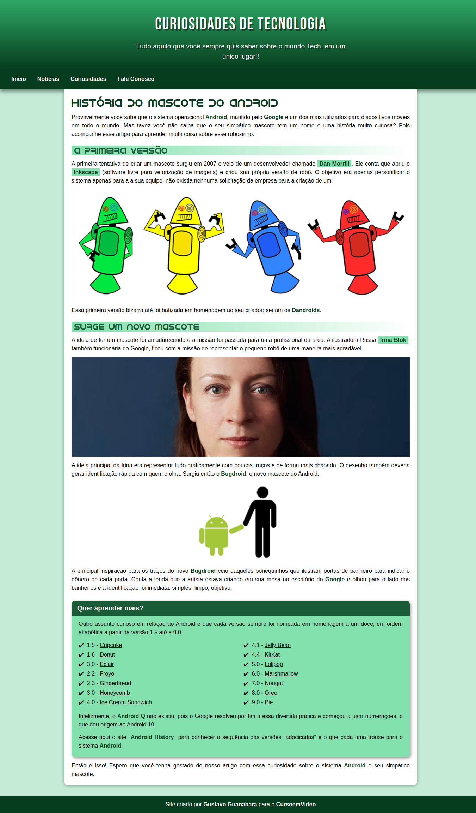

<h1 align="center">🤖 Projeto Android 🤖</h1>

<h3 align="center" style="line-height: 1.5">Projeto desenvolvido no Curso de HTML e CSS do CursoemVideo durante o módulo 02</h3>

 

  

 

  

 

## 🖇️ Acesso ao Projeto

Acesse o projeto clicando [aqui](https://fel1324.github.io/ProjetoAndroid/)

 

## 🚀 Tecnologias

* HTML e CSS
* Git e Github

 

## 💻 Projeto

O projeto destaca a história do mascote do Android, desde a primeira versão até o modelo atual.

 

## 📝 Licença

Esse projeto está sob a licença MIT.